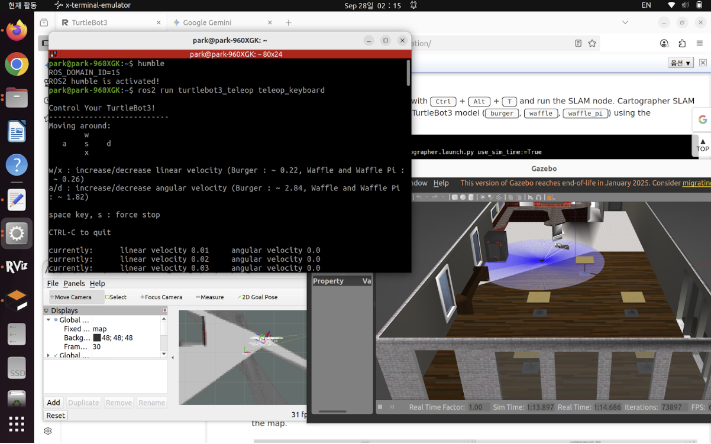
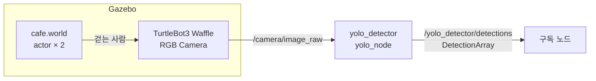

# cafe_yolo

TurtleBot3 Waffle + YOLOv8 인 감지 시뮬레이션 (ROS 2 Humble + Gazebo Classic)

Gazebo 카페 환경에서 걸어다니는 사람(actor)을 TurtleBot3의 RGB 카메라로 촬영하고, YOLOv8이 실시간으로 감지해 ROS 2 토픽으로 발행합니다.



---

## 시스템 구조



| 토픽 | 타입 | 방향 |
|------|------|------|
| `/camera/image_raw` | `sensor_msgs/Image` | Gazebo → yolo_detector |
| `/yolo_detector/detections` | `yolo_msgs/DetectionArray` | yolo_detector → 구독자 |

---

## 패키지 구조

```
src/
├── yolo_msgs/        # 커스텀 메시지 (Detection, BBox2D/3D, KeyPoint 등 12종)
├── yolo_ros/         # YOLO 추론 노드 (yolo_node, detect_3d_node, tracking_node, debug_node)
├── yolo_bringup/     # launch 래퍼 (yolov8.launch.py)
└── two_wheeled_robot/ # Gazebo 시뮬 (카페 월드, TurtleBot3 모델, 가중치)
```

---

## 실행 환경

- ROS 2 Humble
- Gazebo Classic 11
- Ubuntu 22.04
- Python: `ultralytics`, `torch`, `opencv-python`, `cv_bridge`

---

## 빌드 및 실행

### 1. 빌드

```bash
cd ~/cafe_yolo
colcon build --symlink-install
source install/setup.bash
```

### 2. 시뮬레이션 실행

```bash
export TURTLEBOT3_MODEL=waffle
ros2 launch two_wheeled_robot cafe_turtlebot3.launch.py
```

Gazebo가 실행되고 카페 월드에 TurtleBot3 Waffle이 스폰됩니다. actor 2명이 카페 안을 걸어다닙니다.

### 3. 감지 결과 확인

```bash
# 토픽 목록 확인
ros2 topic list

# 감지 결과 raw 출력
ros2 topic echo /yolo_detector/detections

# 토픽 주기 확인
ros2 topic hz /yolo_detector/detections
```

---

## 의존성 설치

```bash
# ROS 2 패키지
sudo apt install ros-humble-gazebo-ros-pkgs \
                 ros-humble-turtlebot3 \
                 ros-humble-turtlebot3-simulations

# Python
pip install ultralytics torch opencv-python
```

---

## 라이선스

이 프로젝트는 [AGPL-3.0](LICENSE) 라이선스를 따릅니다.

`yolo_ros`, `yolo_msgs`, `yolo_bringup` 패키지 원본 작성자: [Miguel Ángel González Santamarta](https://github.com/mgonzs13/yolo_ros)
